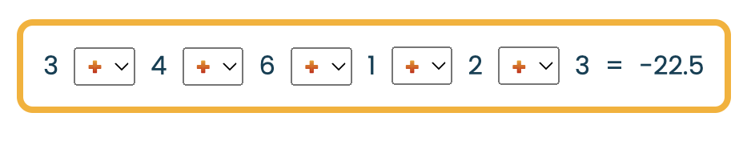

# Operator game

This interactive game lets users practice the mathematical order of operations for learning or fun. 

Users are shown an equation with the operators missing, and they have to guess the correct operators to make the equation true.

The game has a fully [responsive](#responsivity) and [accessible](#accessibility-testing) desgin, and [a kinder scoring mechanism](#scoring-rules), making it suitable for users of a variety of ages and abilities.

Extra features include the user being able to [select the difficulty level](#operand-selector-toggle) and [celebratory "popups" at certain milestones](#milestone-popups).

Developer: [Dr. Sylvia Blaho](https://www.linkedin.com/in/blahosylvia/)

[View the deployed game on Github Pages](https://blahosyl.github.io/operator-game/)

<!--Shield.io badges-->

## User Experience

This game lets users guess the correct operators in an equation with randomly generated integers, and see if their guess is correct. There are no limits on the number of guesses or the length of game play.

Furthermore, since a new, random equation is generated each time, the game can be played a large number of times without the puzzles repeating (unlike a fixed-question trivia game where the users are more likely to memorise all questions).

#### User stories for all users

- [UX1] I want to relax and feel good while improving my skills.
- [UX2] I want to use the game on a variety of screen sizes.
- [UX3] I want to easily navigate between the different stages of the game.
- [UX4] I want to know the next logical step in the game play just by looking at the game elements.
- [UX5] I want to solve a randomly generated puzzle.
- [UX6] I want to know if my guess is correct or not.
- [UX7] I want to keep playing as long as I like.
- [UX8] I want to have the option to keep trying to guess the solution until I get it right **or** move on to the next equation.

#### First-time visitor goals

- [FI1] I want to know how the gameplay works.
- [FI2] I want to know how the scoring works.
- [FI3] I want to open the rule description again at any point during gameplay.
- [FI4] I want to decrease the difficulty level of the game.

#### Returning/frequent visitor goals

Since the game is relatively simple, no distinction is made between returning and frequent visitor goals

- [RE1] I want to quickly start the game without reading the rule again.
- [RE2] I want to increase the difficulty level of the game.

## Design

### Visual design

The intention was to create a visual impression that is retro-inspired but still modern and minimalistic. The design uses rounded rectangles that hark back to the 70ies, bold colors and chunky fonts.

#### Color scheme

The color scheme started out very minimalistic, with only a red and orange border marking the [Game Area](#game-area) and [Question Area](#question-area), respectively. The design remained this minimalistic until the Javascript functions and logic was mostly finished.

The [image](#imagery) selected for the [Milestone "popups"](#milestone-popups) inspired the development of the color scheme to its current form. An image color picker was used to pick colors, which were then used for text elements and backgrounds. 

After this, color contrasts were checked and adjusted (see the [Color contrast testing](#color-contrast-testing) section), resulting in the following color palette:

#### Typography

The project uses 3 [Google Fonts](https://fonts.google.com/):

- [Madimi One](https://fonts.google.com/specimen/Madimi+One) is used for headings and buttons. It is a rounded an interesting font fitting the retro-inspired theme, but it is still easy to read.
- [Bungee Spice](https://fonts.google.com/specimen/Bungee+Spice) is used for displaying operators. Since operators are the main focus of the game, this bold, colorful font highlights them perfectly, and also fits the color scheme.
- [Poppins](https://fonts.google.com/specimen/Poppins) is used for most text. This font is relatively simple and easy to read, and its proportions harmonize with Madimi One.

#### Imagery

The [Milestone image](assets/images/balloons.webp) is the only image used in the game. I chose it because it is cheerful but not overly busy: it mainly has shades of 4 colors: teal, red, orange and pink, which tones down the large number of balloons and pompoms on it.

The [favicon](assets/favicon/android-chrome-192x192.png) used for the project depicts the four operators with  rounded square backgrounds. This was selected because it is explictly referencing the main purpose of the game and also fits the desgin theme. The favicon's color was changed to fit the color palette.

#### Wireframes

Given that the visual part of this game is relatively simple while the JavaScript part is more complex, only one wireframe was made of the [Game Area](#game-area) and the [New Game button](#new-game-button).

The [Welcome screen](#welcome-screen) and the [Milestone "popups"](#milestone-popups) were created without prior wireframing.

### Flow

#### Description of the rules

On loading the page, the [Welcome screen](#welcome-screen) appears, containing a description of how to play the game and how the scoring works.

#### Basic gameplay

1. The game generates a random set of **operands**: positive integers between 1 and 10 (inclusive). These are displayed on the screen, with an operator drop-down toggle between each operand.o
2. The game generates a random set of **operators** from the set [+,-,*,/]. These are never shown to the user.
3. The game also calculates the correct result of the equation based on the randomly generated operators and operands and displays this on the screen.
4. The user has to select the correct operators to make the equation true.

#### Evaluation

The user can check their guess, that is, whether the operators they selected give the correct result, by clicking the [Submit button](#submit-button).

If the guess is correct, a congratulatory message appears, and a new puzzle can be generated with the [New Game button](#new-game-button).

If the guess is incorrect, the user can change the operators and try again as many times as they like. There are no limits on gameplay in terms of time or the number of tries.

#### Difficulty level

The difficulty level of the game is capped in several ways

- only 4 operators are used **+**,**-**, **\***, and **/**
- the right side of the equation has no more than 2 decimal places
- only positive integers are used for operands

The user can adjust the level of difficulty by [selecting how many operands the equation should consist of](#operand-selector-toggle).

#### Scoring rules

The whole game is designed around minimizing stress and only using positive reinforcement. There are no times limits, a decreasing number of "lives" or competition against another player or the computer. These cause unnecessary stress and frustration, and are especially hostile towards people who are neurodivergent or live with mental health issues.

Instead, the game encourages personal growth without measuring ourselves against others, and the agency to set the difficulty of the puzzle to what we can handle at a given time.

Accordingly, incorrect guesses are not counted. The only couter is one of correct answers in a row (the [Perfect Streak counter](#perfect-streak-counter)). This is only reset when the user makes an incorrect guess. Crucially, if the user chooses to skip a puzzle by clikcing the [New Game button](#new-game-button) or reduces the difficulty of the puzzle with the [Operand selector toggle](#operand-selector-toggle), their streak is maintained.

## Features

>[!TIP]
>To facilitate assessment/testing, uncomment one or more of the lines in [`script.js`](assets/js/script.js) following a comment like this:
>
>`// ASSESSMENT uncomment the next line for testing/assessment`
>
>This will show the randomly selected operators and/or the correct equation in the console.

>[!TIP]
>Only screenshots of features are included in this section. For videos of how each feature works, see the [Full testing of functionalities](#full-testing-of-functionalities) section.

### Responsivity

The game is fully responsive for all device emulators available in Chrome Developer tools, and adjusts to narrow viewports including 280 px in width.

### Welcome screen

The **Welcome** screen is the first element the user sees. It is visually different from the main game screen, and can be hidden completely by pressing the [Start Game button](#start-game-button) at the end of the Welcome Screen, and shown again by pressing the [Welcome Screen button](#welcome-screen-button) at the very bottom of the main game screen.

The **Welcome** screen contains the following elements:

- [the section describing of how gameplay works](#gameplay-rules-section), 
- [the section describing of how scoring works](#scoring-rules-section), 
- [the **Start Game** button](#start-game-button) with the text "Let's Play!"

The [second section](#scoring-rules-section) is hidden by default, and only the [first section](#gameplay-rules-section) and the [**Start Game** button](#start-game-button) is shown on page load.

The Welcome Screen is responsive on all devices. On small viewports, the the text inside the Welcome Screen sections is set to scroll.

#### Gameplay Rules section

This section explains the purpose of the game and how it is played. It also contains a small button to switch to the [Scoring Rules section](#scoring-rules-section) within the Welcome Screen.

#### Scoring Rules section

This section explains how the scoring works in the game and why it works the way it does. It also contains a small button to switch to the [Gameplay Rules section](#gameplay-rules-section) within the Welcome Screen.

#### Start Game button

This button hides the welcome screen and reveals the actual game screen. The text on the button has been changed from "Start Game" to a "Let's Play!", as this is deemed more engaging for the user.

### Game Area

The game area includes the following elements:

- a short instruction line on how to play
- the [Question Area](#question-area) displaying the puzzle to be solved
- the [Solution Area](#solution-area) where the feedback message is shown when the user clicks the [**Submit**](#submit-button) button
- the [**Submit**](#submit-button) button that displays the appropriate message in the [Solution Area](#solution-area)

The game area is responsive on all tested devices. 

#### Question Area

The Question Area displays an equation without the appropriate operator(s). Instead of each of the operators, a drop-down selector is shown, where the user can select the correct operator to make the equation true.

The numbers (operands) are selected randomly from the range of integers between 1 and 10 (inclusive). The operators are selected from the array ["+/, "-", "*", "/"].

The operator **+** is shown on each drop-down selector by default. It is reset whenever a new puzzle is generated, but not when the user guess is wrong, so that they can keep track of the guesses they tried more easily.

The difficulty of the puzzle is capped by making sure the result only has a maximum of 2 decimal places. Whenever this is not the case, a new equation is created.

Negative integers are allowed for the solution of the equation, but not for the operands.

By default, the equation has 3 operands and 2 operators. The number of operands and operators in the equation can be changed by the [Operand selector toggle](#operand-selector-toggle).

The question area is also responsive, and adapts to very narrow viewports with a maximum width of 280 px.

#### Solution Area

The Solution Area is empty by default, and its content is added by JavaScript when the [**Submit**](#submit-button) button is clicked. The content varies depending on whether the user got the answer right, and what guess they submitted.

##### Correct guess

If the user's guess is correct, a congratulatory message appears with some celebratory emojis, and the [**Submit**](#submit-button) button is disabled.

The [Perfect Streak counter](#perfect-Streak-counter) is incremented by 1 on a correct guess.

The user can then play a new game by clicing the [New Game button](#new-game-button).

##### Incorrect guess

If the user's quess is incorrect, another message appears, containing the euqation using the operators selected by the users and its result. The user is also instructed to change an operator.

The [**Submit**](#submit-button) button is also disabled in this case, but it is enabled again when the user changes any of the operators. Changing an operator also clears the Solution Area.

The [Perfect Streak counter](#perfect-Streak-counter) is reset to 0 on an incorrect guess, including [Milestone "popups"](#milestone-popups) and their effects on the [Perfect Streak counter](#perfect-streak-counter).

#### Submit button

The Submit button appears at the bottom of the [Game Area](#game-area), and bears the text "Check Answer" by default.

When the Submit button is clicked, the app compares the result of the user's guess with the correct results of the equation.

It also populates the [Solution Area](#solution-area) with content depending on whether the user's guess was correct.

The Submit button is disabled once it has been pressed. It is enabled again in the following cases:

- when the user changes an operator
- when a new game is run
- when the page is reloaded
- when the **Continue** button on a Milestone "popup" is clicked

When the Submit button is re-enabled within a game, its text content changes to "Check Again".

The Submit button also triggers [Milestone "popups"](#milestone-popups) when the [Perfect Streak counter](#perfect-streak-counter) reaches certain values.

### Milestone popups

Certain perfect streak milestones trigger a celebratory "popup". Currently, these are at 3, 5, and 10 correct guesses in a row.

At these points, clicking the Submit button activates the Milestone event. This consists of 2 parts:

1. a "popup" appears with a background picture of colorful balloons, a congratularory text showing the perfect streak length, and a Continue button to return to the game.
2. The [Perfect Streak counter](#perfect-streak-counter) gets a colored background.

The background color of the Milestone text and the Continue button is different for each milestone. The background color of the Perfect Streak text is the same as the background color of the last Continue button.

These color effects use inline HTML styles assigned by the Javascript code. Apart from changing the `display` property of element, this is the only case of using inline styles in this project.

### New Game button 

The New Game button is located directly below the [Game Area](#game-area) and bears the text "New Puzzle" (since "New Game" was found confusing by some testers regarding how the [Perfect Streak counter](#perfect-streak-counter) works).

Clicking the New Game button resets the [Game Area](#game-area) to its defaults and generates a new puzzle, but it does **not** reset the [Perfect Streak counter](#perfect-streak-counter) or the [Operand selector toggle](#operand-selector-toggle) and its effect (see the [Scoring rules](#scoring-rules) section for the reasoning why).

### Perfect Streak counter

The Perfect Streak counter records and displays the length of the user's consecutive correct guesses. It is only resent when the user submits an incorrect guess or reloads the page, but not when the user generates a new puzzle with the [New Game button](#new-game-button) or changes the difficulty level with the [Operand selector toggle](#sperand-selector-toggle) without solving the current puzzle (see the [Scoring rules](#scoring-rules) section for the reasoning why).

The Perfect Streak counter changes background color in connection with the [Milestone "popups"](#milestone-popups): it gets a new background color after every milestone. This color effect is reset when the streak counter is reset.

### Operand Selector toggle

The Operand Selector toggle lets the user choose the difficulty level of the game by selecting the number of operands in the equation they have to solve. The number of operator drop-down selectors is adjusted accordingly (it is one less than the number of operands).

The Operand Selector toggle currently offers a range between 2 and 6 (inclusive). It is set to 3 by default.

When the Operand Selector toggle is changed, the equation template is adjusted to consist of the number of operands selected by the user. This also resets the [Game Area](#game-area) to its defaults and generates a new puzzle, but it does **not** reset the [Perfect Streak counter](#perfect-streak-counter) or the [Operand selector toggle](#sperand-selector-toggle) and its effect (see the [Scoring rules](#scoring-rules) section for the reasoning why).

### Welcome Screen button

This is the last element of the gameplay screen. Its fucntion is to enable the user to show the [Welcome screen](#welcome-screen) again, in case they want to double-chekc the rules. Its text content is "Show the rules again".

This button is hidden whenever the [Welcome screen](#welcome-screen) or a [Milestone "popup"](#milestone-popups) is shown.

### Future implementations

While this game is relatively minimalistic, there are several additional customisation options that were beyond the scope of the current project:

- **the number of operands**: This can easily be changed by modifying the `"number-selector"` form in the HTML code to include larger numbers. The only concern  here is that the [Question area](#question-area) might look overcrowded and take up too much space on smaller screens.
- **the range of operands**: This is also easily changed by modifying "11" in the function `showRandomOperands(11)` in the [Javascript code](assets/js/script.js) to an integer of our choice. 
	- As a further enhancement, a drop-down similar to the [Operand Selector toggle](#operand-selector-toggle) could let the user choose the upper bound of the generated operands themselves.
- **negative operands**: By rewriting the function `generateRandomNumbers()` in the [Javascript code](assets/js/script.js) so that each operand is multiplied by either `1` or `-1` randomly, negative operands can be included in the game. The function `eliminateZero()` would still make sure 0 is not one of the operands.
- **the range of operators**: Exponentiation is fairly straightforward to add by modifying the function `generateRandomOperators()` in the [Javascript code](assets/js/script.js) so that the `operators` array includes `**` for exponentiation.
	- Including roots and parentheses in the equation would require some more rewriting of the concatenation and evaluation rules of the game.
- **color palettes**: A different kind of customisation option would be to enable the user to choose their preferred color palette. There are 2 different ways of implementing this:
	1. Users can select any color for certain elements in the game. This can be implemented with a some  color picker `form` elements. However, additional care has to be taken when selecting which elemts the user can change, to ensure that [sufficient color contrasts are maintained](#color-contrast-testing).
	2. Users can select between pre-defined color palettes, changing several elements at once. Naturally, [color contrast testing](#color-contrast-testing) would also need to be done as part of implementing this feature.
- **a timer option**: This is a very popular option for small games and quizzes, however, it is contrary to the ["kinder scoring" approach](#scoring-rules) taken in this game. Therefore, I would only choose to implement a timer as an opt-in, non-default option for this game.

### Accessibility

The game avoids visual clutter, such as excessive borders and shadows, elements of very different shapes, color gradients, transparency, background images behind normal text, and auto-moving elements of all kinds. 

These elements tend to cause problems for a variety of users (e.g. those with visual impairment, executive functioning impairment, vertigo, etc.), so steering clear of these chimes in perfectly with accessibility goals.

The content of the site is structured with semantic tags, and Aria labels are used for sections without headings.

Alt text is used for embedded visual elements.

The color scheme was designed to ensure sufficient contrast for legibility, and modified where necessary to ensure that color combinations meet [WCAG AAA](https://ialabs.ie/what-is-the-difference-between-wcag-a-aa-and-aaa/) standards (see the [Accessibility testing](#accessibility-testing) section for more detail).

The fonts used in the game are easy to read, prioritizing legibility over eccentricity. 

External links open in a new tab.

## Technologies used

### Languages used

- HTML 
- CSS
- JavaScript
- Markdown

### Frameworks, libraries & programs used

- [Am I Responsive?](https://ui.dev/amiresponsive) – show the website on a range of devices
- [Balsamiq](https://balsamiq.com/) – create wireframes
- [Birme](https://www.birme.net/) – resize image and convert to `webp` format
- [Coolors.co](https://coolors.co/) - color palettes
- [Favicon.io](https://favicon.io/) – create the favicon
- [Flaticon](https://www.flaticon.com/) – search for image for favicon
- [FontAwsome](https://fontawesome.com/) – icons for operators (not used in the final version)
- [Git](https://git-scm.com/) – version control
- [GitHub](https://github.com/) – store the source files
- [GitHub Desktop](https://desktop.github.com/) – GitHub UI
- [GitHub Issues](https://github.com/features/issues) – project management, bug tracking
- [GitHub TOC generator](http://github.com/3kh0/readme-toc/) – automatically generate a Markdown TOC
- [GitHub web editor](https://github.com/) - the only way (known to me) to add videos to the README
- [GitPod](https://gitpod.io/) – Integrated Development Environment (only used for tutoring)
- [Google Chrome Developer Tools](https://developer.chrome.com/docs/devtools) – troubleshoot, test responsivity and styling
- [Google Fonts](https://fonts.google.com/) - import fonts used on the website
- [Image color picker](https://imagecolorpicker.com/) – color picker from image
- [Lipsum](https://www.lipsum.com/), [loremipsum.io](https://loremipsum.io/) – Lorem Ipsum generators (not used in final version)
- [MacDown](https://macdown.uranusjr.com/) – Markdown editor
- [Preview](https://support.apple.com/guide/preview/welcome/mac) – cropping and annotating images
- [PythonTutor](https://pythontutor.com/) – debugging Javascript Code
- [Redketchup.io](https://redketchup.io/color-picker) - color picker from image
- [Shields.io](https://shields.io/) – add badges to README
- [Slack](https://slack.com/) – mentor communication
- [Visual Studio Code](https://code.visualstudio.com/) – code edito
- [WebAIM](https://webaim.org/resources/contrastchecker/) – color contrast checking
- [Web Disability Simulator](https://chromewebstore.google.com/detail/web-disability-simulator/olioanlbgbpmdlgjnnampnnlohigkjla) – accessibility testing

## Deployment

### Local deployment

To view the site on your local machine (laptop or desktop), follow these steps:

1. click the following link to download the [zipped project folder from GitHub](https://github.com/blahosyl/operator-game/archive/refs/heads/main.zip).
2. double click on the downloaded zip file `operator-game-main.zip` to unzip it.
3. in the folder `operator-game`, double click on `index.html` to open it in your browser.

>[!IMPORTANT]
> Do not take `index.html` out of the folder, or change the folder structure in any way, as this may break the file paths defined in the project. 

### Fork the repository

You can fork the repository by following these steps:

1. Log in to [GitHub](https://github.com/) (if you don't have a GitHub account yet, you can [create one](https://docs.github.com/en/get-started/start-your-journey/creating-an-account-on-github) for free).
2. Navigate to the project website [https://github.com/blahosyl/operator-game](https://github.com/blahosyl/operator-game).
3. Click on **Fork** in the upper right part of the screen.
4. On the next page you have the possibility to change the repository name. To do this, simply write your desired name in the text field in the center part of the screen. You can also leave the name as it is.
5. Click **Fork** in the bottom right part of the screen.

>[!TIP]
>If you do rename the repository, make sure to keep the [GitHub naming conventions](https://github.com/bcgov/BC-Policy-Framework-For-GitHub/blob/master/BC-Gov-Org-HowTo/Naming-Repos.md) in mind. 

### Deployment on GitHub Pages

The site was deployed on GitHub pages using the steps below. You can follow the same steps to deploy it on your GitHub account after you have forked the repository.

1. Log in to [GitHub](https://github.com/) (if you don't have a GitHub account yet, you can [create one](https://docs.github.com/en/get-started/start-your-journey/creating-an-account-on-github) for free).
2. Navigate to the project website [https://github.com/blahosyl/operator-game](https://github.com/blahosyl/operator-game).
3. Click on [Settings](https://github.com/blahosyl/operator-game/settings) in the top right of the screen.
4. On the left-hand menu, click [Pages](https://github.com/blahosyl/operator-game/settings/pages).
5. In the center of the page under **Branch**, select **main** from the dropdown menu, then click **Save**.
6. After the site refreshes automatically, a message appears in the top center part of the screen, displaying the link to the deployed site: "Your site is live at [https://blahosyl.github.io/operator-game/](https://blahosyl.github.io/operator-game/)". 

>[!NOTE]
>The link will look stlightly different for you, containing your [GitHub username](https://docs.github.com/en/account-and-profile/setting-up-and-managing-your-personal-account-on-github/managing-email-preferences/remembering-your-github-username-or-email) instead of `blahosyl`. 

>[!NOTE]
>If you have renamed the repository when forking it, your chosen repository name will appear instead of `operator-game` in the deployment link.

## Testing

>[!TIP]
>To facilitate assessment/testing, uncomment one or more of the lines in [`script.js`](assets/js/script.js) following a comment like this:
>
> `// ASSESSMENT uncomment the next line for testing/assessment`
> 
> This will show the randomly selected operators and/or the correct equation in the console.

Issues and bugs are tracked in [Github Issues](https://github.com/blahosyl/operator-game/issues).

### Automated testing

#### Code validation

The [`html`](#html-validation-with-the-w3c-validator), [`css`](#css-validation-with-jigsaw) and [`js`](#javascript-validation-with-jshint) files of the project were periodically validated throughout development.

The issues discovered during validation are tracked in GitHub Issues [#37](https://github.com/blahosyl/operator-game/issues/37) and [#38](https://github.com/blahosyl/operator-game/issues/38).

##### HTML validation with the W3C validator

The `html` file of the project was regularly tested by the [W3C validator](https://validator.w3.org/). 

In the current version of the site, [no errors or warnings were found during validation](https://validator.w3.org/nu/?doc=https%3A%2F%2Fblahosyl.github.io%2Foperator-game).

##### CSS validation with Jigsaw

The  `css` file of the project was regularly tested by [Jigsaw](https://jigsaw.w3.org/css-validator/). The issues discovered during validation are tracked in [GitHub Issues](https://github.com/blahosyl/operator-game/issues).

In the current version of the site, [no errors or warnings were found during validation](https://jigsaw.w3.org/css-validator/validator?uri=https%3A%2F%2Fblahosyl.github.io%2Foperator-game%2F&profile=css3svg&usermedium=all&warning=1&vextwarning=&lang=en).

##### JavaScript validation with JSHint

The  `js` file of the project was regularly tested by [JSHint](https://jshint.com/). The issues discovered during validation are tracked in [GitHub Issues](https://github.com/blahosyl/operator-game/issues).

In the current version of the site, no errors or warnings were found during validation.

#### Lighthouse

##### Lighthouse performance testing

Lighthouse performance tests were carried out throughout development (selected tests can be found in the folders [`lighthouse-performance`](testing/automated-testing/lighthouse-performance)) and [`lighthouse-full`](testing/automated-testing/lighthouse-full)). No significant issues were found.

The current performance score is [90 on mobile](testing/automated-testing/lighthouse-full/mobile/blahosyl.github.io-20240401T134642.html) and [100 on desktop](testing/automated-testing/lighthouse-full/desktop/blahosyl.github.io-20240401T134508.html).

##### Lighthouse accessibility testing

Lighthouse accessibility tests were carried out throughout development (selected tests can be found in the folders [`lighthouse-accessibility`](testing/automated-testing/lighthouse-accessibility)) and [`lighthouse-full`](testing/automated-testing/lighthouse-full)). 

One issue was found, which was fixed in [this commit](https://github.com/blahosyl/operator-game/commit/f05ec2ee280be0389fb87750e6a2e98705d1c5fd).

The current performance score is 100 on both [mobile](testing/automated-testing/lighthouse-full/mobile/blahosyl.github.io-20240401T134642.html) and [desktop](testing/automated-testing/lighthouse-full/desktop/blahosyl.github.io-20240401T134508.html).

### Manual testing

#### Testing user stories

The user stories from the [User Experience](#user-experience) section are repeated here for convenience.

#### User stories for all users

- [UX1] I want to relax and feel good while improving my skills.
- [UX2] I want to use the game on a variety of screen sizes.
- [UX3] I want to easily navigate between the different stages of the game.
- [UX4] I want to know the next logical step in the game play just by looking at the game elements.
- [UX5] I want to solve a randomly generated puzzle.
- [UX6] I want to know if my guess is correct or not.
- [UX7] I want to keep playing as long as I like.
- [UX8] I want to have the option to keep trying to guess the solution until I get it right **or** move on to the next equation.

|Goal	|Feature facilitating the goal|
|---	|---|
|UX1	|[Perfect streak counter](#perfect-streak-counter)|
|UX1	|[Milestone "popups"](#milestone-popups)|
|UX1	|[Visual design](#visual-design)|
|UX1	|[Scoring rules](#scoring-rules)|
|UX2	|[Responsivity of all elements](#responsivity)|
|UX3	|[Welcome screen text](#welcome-screen)|
|UX4	|Text copy|
|UX4	|[Color scheme](#color-scheme)|
|UX5	|[Game Area](#game-area)|
|UX5	|[Question Area](#question-area)|
|UX6	|[Solution Area](#solution-area)|
|UX6	|[Submit button](#submit-button)|
|UX7	|[Game flow design](#flow)|
|UX8	|[Game flow design](#flow)|
|UX8	|[New Game button](#new-game-button)|
|UX8	|[Game Area](#game-area)|

#### First-time visitor goals

- [FI1] I want to know how the gameplay works.
- [FI2] I want to know how the scoring works.
- [FI3] I want to open the rule description again at any point during gameplay.
- [FI4] I want to decrease the difficulty level of the game.

|Goal	|Feature facilitating the goal|
|---	|---|
|FI1	|[Gameplay rules section on the Welcome screen](#welcome-screen)|
|FI2	|[Scoring rules section on the Welcome screen](#welcome-screen)|
|FI3	|[Welcome screen button](#welcome-screen-button)|
|FI4	|[Operand Selector toggle](#operand-selector-toggle)|

#### Returning/frequent visitor goals

Since the game is relatively simple, no distinction is made between returning and frequent visitor goals

- [RE1] I want to quickly start the game without reading the rule again.
- [RE2] I want to increase the difficulty level of the game.

|Goal	|Feature facilitating the goal|
|---	|---|
|RE1	|[Start Game button on the Welcome screen](#start-game-button)|
|RE2	|[Operand Selector toggle](#operand-selector-toggle)|

#### Full testing of functionalities

##### Devices

The website was tested on all emulators available on Chrome Developer tools. In addition, it was tested on the following devices:

 - iPhone 12 Pro, iOS 17.4.1
 - Macbook Air M2, Mac OS Sonoma 14.3.1 
 - Macbook Air M1, Mac OS Sonoma 14.3.1

 ##### Browsers

The site was tested on the following browsers:

- Google Chrome (mobile and desktop)
- Mozilla Firefox (desktop)
- Microsoft Edge (desktop)

##### Responsivity testing

|Functionality	|Expected behavior	| result|
|:---				|:---					| :---: |
|The Welcome screen is responsive	 |Elements get realigned to fit the viewport size |✅|

Click to play the video

[Welcome screen responsivity test](https://github.com/blahosyl/operator-game/assets/26421503/6da41494-7f39-4491-9f0e-c564f69d5719)

|Functionality	|Expected behavior	| result|
|:---				|:---					| :---: |
|The Game Area screen is responsive |Elements get realigned to fit the viewport size |✅|

Click to play the video

[Game Area responsivity test](https://github.com/blahosyl/operator-game/assets/26421503/1b505c30-69f5-4194-8914-07d36674d590)

|Functionality	|Expected behavior	| result|
|:---				|:---					| :---: |
|The Milestone "popup"	is responsive|Elements get realigned to fit the viewport size |✅|

Click to play the video

[Milestone "popup" responsivity test](https://github.com/blahosyl/operator-game/assets/26421503/99d975ee-eb60-471a-8910-7c1f012a5525)

##### Welcome screen testing

|Functionality	|Expected behavior	| result|
|:---				|:---					| :---: |
|The Welcome screen appears by default |The Welcome screen appears when the page is (re-)loaded |✅|

Click to play the video

[Welcome screen appears on page load](https://github.com/blahosyl/operator-game/assets/26421503/9a100d4a-63fd-4ef5-b74a-9c7d0d0887b4)

|Functionality	|Expected behavior	| result|
|:---				|:---					| :---: |
|The small button in the Gameplay Rules section switches to the Scoring Rules section |When the button is clicked, the Gameplay Rules section is hidden and the Scoring Rules section appears	|✅|
|The small button in the Scoring Rules section switches to the Gameplay Rules section |When the button is clicked, the Scoring Rules section is hidden and the Gameplay Rules section appears |✅|

Click to play the video

[Testing the small buttons on the welcome screen](https://github.com/blahosyl/operator-game/assets/26421503/a183d615-d378-4609-bbd2-08e429da7eca)

|Functionality	|Expected behavior	| result|
|:---				|:---					| :---: |
|The big button in the Welcome section starts the game |When the button is clicked, the Welcome section is hidden and the Game Area appears |✅|
|The Question Area displays a random puzle |When the game starts, a randomly generated equation appears |✅|

Click to play the video

[Start Game test](https://github.com/blahosyl/operator-game/assets/26421503/ceb791f1-68ff-418b-ab3a-d6d752c3f667)

##### Game Area testing

|Functionality	|Expected behavior	| result|
|:---				|:---					| :---: |
|The Solution Area displays a congratulatory message on a correct guess |When the user's guess is equal to the solution when the Submit button is pressed, a congratulatory message appears |✅|
|The Submit button is disabled on a guess |When when the Submit button is pressed, the button is disabled until further action |✅|

Click to play the video

[Correct guess test](
https://github.com/blahosyl/operator-game/assets/26421503/26ef5d43-7e68-4245-abf3-ca9788567e33)

|Functionality	|Expected behavior	| result|
|:---				|:---					| :---: |
|The Solution Area displays a message with the user's result on an incorrect guess |When the user's guess is not equal to the solution when the Submit button is pressed, a message appears with the user's result and instructions to change an operator |✅|
|The Solution Area is cleared when an operator is changed |When the user changes an operator after a guess, the Solution Area is cleared |✅|
|The Submit button is re-enabled when an operator is changed |When the user changes an operator after a guess, the button is re-enabled |✅|
|If Submit button text changes when an operator is changed |When the user changes an operator after a guess, the button text is changed to "Check Again" |✅|
|The Submit button is re-enabled when the page is re-loaded |When the user reloads the page, the Submit button is re-enabled |✅|
|The background color of the Perfect Streak text is reset at an incorrect guess |The background color of the Perfect Streak text set back to white after an incorrect guess |✅|

Click to play the video

[Incorrect guess test](https://github.com/blahosyl/operator-game/assets/26421503/a754a88b-349e-4be0-a644-c83a4f83971b)

##### New Game button testing

|Functionality	|Expected behavior	| result|
|:---				|:---					| :---: |
|The New Game button resets the Game Area |When the user clicks the New Game button, a new equation is generated, the Solution Area is cleared and the Submit button is re-enabled |✅|
|The New Game button does **not** reset elements outside the Game Area |When the user clicks the New Game button, the Perfect Streak counter and the operand selector are **not** changed |✅|
|The Submit button is re-enabled when a new game starts |When the user clicks the New Game button and a new game starts, the Submit button is re-enabled |✅|

[New Game button test](
https://github.com/blahosyl/operator-game/assets/26421503/af9c1a4e-14d5-427a-9f9b-587f7f8839d3)

|Functionality	|Expected behavior	| result|
|:---				|:---					| :---: |
|The Question Area never displays an equation with more than 2 decimal places |When the solution has more than 2 decimal places, a new equation is generated without further action |✅|

Click to play the video

[New Game decimals test](https://github.com/blahosyl/operator-game/assets/26421503/37ef4343-2c72-4e57-a21d-616c1c15b65e)

##### Milestone "popups" testing

|Functionality	|Expected behavior	| result|
|:---				|:---					| :---: |
|Certain Perfect Streak milestones trigger a "popup" |When the Perfect Streak counter reaches 3, 5 and 10, a "popup" with a picture of balloons appears |✅|
|Each Milestone "popup" has a different color scheme |The background color of the Milestone text and the Continue button is different for each milestone |✅|
|Each Milestone "popup" changes the background color of the Perfect Streak text |The background color of the Perfect Streak text is the same as the background color of the last Continue button |✅|
|The Submit button is re-enabled after a Milestone "popup" |When the user clicks the Continue button on a Milestone "popup", the Submit button is re-enabled |✅|

Click to play the video

[Milestone "popup" test](https://github.com/blahosyl/operator-game/assets/26421503/d026e7f8-1b37-4e4b-8486-e2ca3af602b8)

##### Perfect streak counter testing

|Functionality	|Expected behavior	| result|
|:---				|:---					| :---: |
|The Perfect streak counter is increased by 1 on a correct guess |When the user's guess is equal to the solution when the Submit button is pressed, the Perfect Streak counter is increased by 1 |✅|
|The Perfect streak counter is reset to 0 on an incorrect guess |When the user's guess is not equal to the solution when the Submit button is pressed, the Perfect Streak counter is reset to 0 |✅|

##### Operand selector toggle testing

|Functionality	|Expected behavior	| result|
|:---				|:---					| :---: |
|The number of operands in the Question Area increases on user input |When the operand toggle is increased by the user, the Question Area displays a new equation with the selected number of operands and one less operator drop-down selector |✅|
|The number of operands in the Question Area descreases on user input |When the operand toggle is increased by the user, the Question Area displays a new equation with the selected number of operands and one less operator drop-down selector |✅|
|The Operand selector toggle does **not** reset elements outside the Game Area |When the user changes the value of the Operand selector toggle, the Perfect Streak counter is **not** changed |✅|
|The Operand selector toggle never results in an equation with more than 2 decimal places|When the solution has more than 2 decimal places, a new equation is generated without further action|✅|

Click to play the video

[Operand Selector toggle test](https://github.com/blahosyl/operator-game/assets/26421503/3a88b3df-78f7-4ea8-980f-5e999e4cb160)

##### Welcome Screen button testing

|Functionality	|Expected behavior	| result|
|:---				|:---					| :---: |
|The Welcome Screen button triggers the Welcome Screen |When the Welcome Screen button is clicked by the user, the Welcome Screen appears |✅|
|The Welcome Screen button disappears when the Welcome Screen is shown |When the Welcome Screen button is clicked by the user, the Welcome Screen button disappears |✅|
|The Welcome Screen button disappears when a Milestone "popup" is shown |When a Milestone "popup" is triggered by the user, the Welcome Screen button disappears |✅|
|The Welcome Screen button appears with the Game Area |When the Game Area is visible, the Welcome Screen button appears |✅|
|The Welcome Screen button does **not** reset the Game Area |When the Welcome Screen button is clicked, the Game Area remains unchanged |✅|

Click to play the video

[Welcome Screen button test](https://github.com/blahosyl/operator-game/assets/26421503/e834a5fb-741a-4785-b4a2-4100e23742ce)

### Accessibility testing

#### Automated accessibility testing

The process and results of automated accessibility testing can be found in the section [Lighthouse accessibility testing](#lighthouse-accessibility-testing).

#### Manual accessibility testing

##### Color contrast testing

The [WebAIM](https://webaim.org/resources/contrastchecker/) was used to ensure that the text and background color of each section provides sufficient contrast for legibility.

In the instances where this was not the case, the colors themselves or their arrangement was changed to ensure that accessibility standards are met. Related issues are [#41](https://github.com/blahosyl/operator-game/issues/41) and [#15](https://github.com/blahosyl/operator-game/issues/15), as well as [this commit](https://github.com/blahosyl/operator-game/commit/f2fad4e27e714602503d1abe5dffd858d1ce7f65).

The resulting color scheme is as follows:

The color variable names used in the project are as follows:

|color name 	|HEX code|
|---			|---	|
|dark-blue	|#004056| 
|med-blue		|#2E7E8E| 
|light-blue	|#1ADAE8|
|peach			|#FCBFAB|
|med-orange	|#DC3A04|
|light-orange	|#FCAF02|
|red			|#EB0000| 
|white			|#FFFFFF| 
|black			|#000000|

The paired colors have the following contrasts:

| color 1 |color 2 |contrast | [WCAG AAA](https://ialabs.ie/what-is-the-difference-between-wcag-a-aa-and-aaa/) | comments |
|---			|---		|:---:		|:---:|--- |
|dark-blue 	|white 	|11.24:1 	| ✅ |   |
|orange	 	| dark-blue | 6.03:1 |✅|only used for large text|
|med-blue 	| white 	| 4.52:1 	| ✅ |only used for large text|
|red 			| white	 | 4.63:1	| ✅ |only used for large text|
|med-orange 	| white	| 4.51:1	|✅ |only used for graphical objects|
|light-orange |black	|11.27:1	|✅	 |	|
|light-blue 	|black 	|12.23:1	|✅ |	|
|light-blue 	|dark-blue|6.55:1	|✅ |	|
|peach		 	|dark-blue|7.05:1	|✅ |	|

##### Web Disability Simulator

The [Web Disability Simulator](https://chromewebstore.google.com/detail/web-disability-simulator/olioanlbgbpmdlgjnnampnnlohigkjla) was used to check the site for a variety of conditions. The site was found to be fully functional for these conditions:

- Sight
	- Total color blindness
	- Yellow-Blue color blindness
	- Red-Green color blindness
	- Sunshine
- Mobility
	- Parkinsons (keyboard navigation)

In addition, the design accommodates the following conditions with some of its properties:

- Read and write
	- Dyslexia
		- avoid long blocks of text
		- use proper spacing and line height
		- avoid fonts with complicated and complex characters
- Concentration
	- give the website a simple and clean design
	- avoid animations or auto-playing elements
	- avoid having too much content on the same page

### Bugs

All bugs are tracked in [GitHub Issues](https://github.com/blahosyl/operator-game/issues).

#### Known bugs

There are no known bugs in the project.

#### Solved bugs

Solved bugs are listed in [GitHub Issues](https://github.com/blahosyl/operator-game/issues?q=is%3Aissue+label%3Abug).

## Credits

### Study materials

The following resources were used to learn/double check general, atomic functionalities/syntax:

- [`form select` element](https://www.w3schools.com/html/html_form_elements.asp)
- [Get the `value` from a `select` form](https://www.w3schools.com/jsref/prop_select_value.asp)
- [Select the default value in a `select` form](https://stackoverflow.com/a/3518011)
- [`form` color picker](https://www.w3schools.com/html/tryit.asp?filename=tryhtml_input_color)
- [Call a function within a function](https://stackoverflow.com/a/4524890)
- [Slice a character off the end of a string](https://stackoverflow.com/a/952945)
- [Remove a certain characrer from a string](https://www.scaler.com/topics/javascript-remove-character-from-string/)
- [Evaulate a string as a mathematical expression](https://developer.mozilla.org/en-US/docs/Web/JavaScript/Reference/Global_Objects/eval#never_use_direct_eval!)
- [Docstrings](https://stackoverflow.com/questions/34205666/utilizing-docstrings)
- [Enable and disable an input button](https://stackoverflow.com/a/13831737)
- [Check if a number is an integer](https://developer.mozilla.org/en-US/docs/Web/JavaScript/Reference/Global_Objects/Number/isInteger)
- [Set timeout before `alert` execution](https://stackoverflow.com/a/41936135)
- [Clone node](https://www.w3schools.com/jsref/met_node_clonenode.asp)
- [Insert before](https://www.w3schools.com/jsref/met_node_insertbefore.asp)
- [Change display style of DOM elements with Javasscript](https://www.w3schools.com/jsref/prop_style_display.asp)
- [Inheriting opacity in CSS](https://css-tricks.com/forums/topic/opacity-of-child-element/), [2](https://stackoverflow.com/questions/5770341/i-do-not-want-to-inherit-the-child-opacity-from-the-parent-in-css)
- [CSS `overflow`](https://www.w3schools.com/cssref/pr_pos_overflow.php)
- [Iterate over a string](https://buzzcoder.gitbooks.io/codecraft-javascript/content/string/loop-through-a-string.html)
- [`replace()` method](https://www.freecodecamp.org/news/javascript-replace-how-to-replace-a-string-or-substring-in-js/)
- [Box shadows](https://developer.mozilla.org/en-US/docs/Web/CSS/box-shadow)

### Code

The following sources contributed code or suggestions to specific functions within the project:

- Lewis from the tutoring team helped me solve [this issue](https://github.com/blahosyl/operator-game/issues/3).
- Roo from the tutoring team helped me solve [this issue](https://github.com/blahosyl/operator-game/issues/5).
- Rory Patrick Sheridan, my mentor, helped me solve this [JSHint warning](https://github.com/blahosyl/operator-game/issues/38), and gave me the tips and and heads up described in [these issues](https://github.com/blahosyl/operator-game/issues?q=is%3Aissue+label%3Amentor).

### Content

All text content was written by me.

### Media

#### Images

Favicon: [Mathematics icons created by Freepik - Flaticon](https://www.flaticon.com/free-icon/mathematics-symbol_3477889?term=mathematics&page=1&position=25&origin=tag&related_id=3477889), modified to fit the color scheme by me, converted to `ico` format with [Favicon.io](https://favicon.io/)

Milestone image by [vector_corp on Freepik](https://www.freepik.com/free-ai-image/colorful-balloons-decor-background_77741605.htm#page=3&position=9&from_view=search&track=ais&uuid=777890df-6c6e-4ecf-90da-7587aff2328e).

### Readme

- [Creating your first README with Kera Cudmore](https://www.youtube.com/watch?v=XbYJ4VlhSnY) by Code Institute
- [Creating your first README](https://github.com/kera-cudmore/readme-examples) by Kera Cudmore
- [Bully Book Club](https://github.com/kera-cudmore/Bully-Book-Club) by Kera Cudmore
- [Bodelschwingher Hof](https://github.com/4n4ru/CI_MS1_BodelschwingherHof/tree/master) by Ana Runje
- [Travel World](https://github.com/PedroCristo/portfolio_project_1/) by Pedro Cristo
- [Sourdough Bakes](https://github.com/siobhanlgorman) by Siobhan Gorman
- [Horizon Photo](https://github.com/Ri-Dearg/horizon-photo/blob/master/README.md#mobile-testing) by Rory Patrick Sheridan
- [The README of my first Code Institute project](https://github.com/blahosyl/academic-publishing)

### Acknowledgements

I would like to thank Peter Litauszki for giving me the idea for this project, and for being an enthusiastic test subject and video editor.

I am also grateful to my mentor Rory Patrick Sheridan for his super-useful advice and great insights!

Last but definitely not least, I would like to thank [Lewis](https://github.com/blahosyl/operator-game/issues/3) and [Roo]((https://github.com/blahosyl/operator-game/issues/5)) from the tutoring team for their efficient and friendly help when I got stumped.
